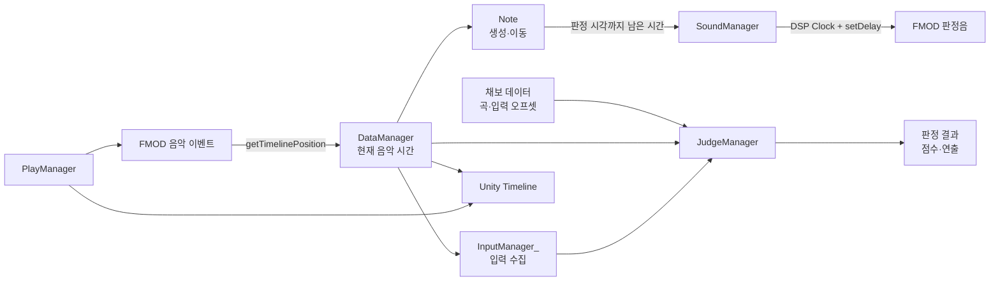

# FMOD 기반 리듬게임 시간 동기화 및 판정 시스템

## 개요

Noise Canceler의 리듬 시스템은 FMOD의 음악 재생 위치를 하나의 기준 시간으로 사용합니다. 한 프레임 안에서는 음악 시간을 먼저 갱신하고, 그 값을 노트 이동과 입력 판정이 함께 참조합니다. 판정음은 렌더링 프레임에서 즉시 출력하지 않고 FMOD DSP Clock에 예약하여 음악과 같은 오디오 시간축에서 재생합니다.

이 구조의 목적은 다음과 같습니다.

- 음악, 노트, 입력 판정이 서로 다른 시간값을 참조하지 않도록 합니다.
- 프레임 저하가 발생해도 노트 위치를 `deltaTime` 누적값이 아닌 현재 음악 시간으로 계산합니다.
- 같은 프레임 안에서 시간 갱신, 입력 수집, 판정의 순서를 명시적으로 보장합니다.
- 판정음의 출력 시점을 렌더링 프레임과 분리합니다.
- 일시정지와 재개 후에도 FMOD 음악과 Unity Timeline 연출을 다시 동기화할 수 있게 합니다.

초기 `AudioSource.time` 구현에서 현재 구조에 도달한 과정은 [음악 시간 계산 오차로 인한 판정 정확도 개선](../trouble-shooting/rhythm-timing-accuracy.md)에 정리했습니다.

## 담당 범위

1인 개발자로서 음악 시간 기준 설계, 입력 판정 로직, FMOD 판정음 예약, Unity Timeline 동기화와 관련 구현을 담당했습니다.

## 전체 구조



핵심은 `DataManager`가 가져온 현재 음악 시간을 다른 시스템이 공통으로 읽는다는 점입니다. 각 시스템이 자체 타이머를 누적하지 않기 때문에 시간이 서로 어긋나는 경로를 줄였습니다.

## 구성 요소와 책임

| 구성 요소 | 책임 |
|---|---|
| `UpdateManager` | 리듬 로직의 프레임 실행 순서를 관리합니다. |
| `DataManager` | FMOD에서 현재 음악 재생 위치를 가져와 `songPosition`으로 제공합니다. |
| `PlayManager` | 음악 재생, 노트 생성, 일시정지·재개, Unity Timeline 동기화를 담당합니다. |
| `InputManager_` | 키 입력을 수집해 누름·뗌 이벤트를 전달합니다. |
| `JudgeManager` | 입력 시각과 노트 시각을 비교하고 판정 결과를 결정합니다. |
| `Note` | 음악 시간으로 현재 위치를 계산하고 판정음 예약 시점을 전달합니다. |
| `SoundManager` | FMOD DSP Clock을 기준으로 판정음을 예약 재생합니다. |

## 음악 시간을 단일 기준으로 사용

매 프레임 `DataManager`는 FMOD `EventInstance.getTimelinePosition()`을 호출해 현재 음악 위치를 밀리초 단위로 갱신합니다.

```csharp
public override void CustomUpdate()
{
    playManager.SongEventInstance.getTimelinePosition(out sheetData.songPosition);
}
```

현재 음악 시간은 노트 이동, 판정, 노트 생성 시점, Timeline 동기화에서 공통으로 사용합니다. 이 값은 렌더링 프레임마다 한 번 조회되지만, `deltaTime`을 더해 만든 게임 타이머가 아니라 FMOD가 실제로 재생 중인 음악 위치를 기준으로 합니다.

## 프레임 실행 순서 고정

Unity 컴포넌트의 개별 `Update()` 호출 순서에 의존하면 입력이 이전 프레임의 음악 시간으로 판정될 수 있습니다. 이를 방지하기 위해 `UpdateManager`가 `CustomUpdate()`를 다음 순서로 호출합니다.

```text
1. DataManager    : FMOD 음악 시간 갱신
2. InputManager_  : 현재 프레임의 입력 수집
3. JudgeManager   : 갱신된 음악 시간으로 판정 및 Miss 처리
```

따라서 입력 이벤트가 `JudgeManager`로 전달될 때는 같은 프레임에서 먼저 갱신한 `songPosition`을 사용할 수 있습니다. 이 순서는 각 씬의 직렬화된 설정으로 관리되므로, 새 씬을 구성할 때도 동일한 순서를 유지해야 합니다.

## 노트 생성과 이동

`PlayManager`는 현재 음악 시간이 노트의 등장 시각에 도달하면 오브젝트 풀에서 노트를 가져옵니다. 노트는 생성 후 매 프레임 속도를 누적하는 대신, 현재 음악 시간이 이동 구간에서 차지하는 비율을 계산해 위치를 결정합니다.

```csharp
float ratio = (currentSongTime - noteStartTime) / noteTakeTime;
transform.position = Vector3.LerpUnclamped(startPoint, judgePoint, ratio);
```

프레임이 잠시 지연되더라도 다음 프레임에는 현재 음악 시간에 해당하는 위치를 다시 계산합니다. 따라서 프레임 누락으로 발생한 이동 오차가 이후 프레임에 계속 누적되지 않습니다.

## 입력 판정

판정의 기준은 입력이 발생한 시점의 음악 시간과 오프셋이 반영된 노트 판정 시각의 차이입니다.

```text
판정 오차 = 현재 음악 시간
          - (노트 판정 시각 + 곡 오프셋 + 사용자 입력 오프셋)
```

- 곡 오프셋은 음원과 채보 전체의 기준 차이를 보정합니다.
- 사용자 입력 오프셋은 입력 장치와 플레이 습관에 따른 체감 차이를 보정합니다.
- 판정 오차의 절댓값이 작을수록 노트 시각에 가까운 입력입니다.

현재 판정 범위는 다음과 같습니다.

| 판정 | 오차 범위 |
|---|---:|
| Perfect | ±66.67 ms 미만 |
| Good | ±100.1 ms 미만 |
| Noisy | ±150.1 ms 미만 |
| Miss | 판정 가능 시점을 지난 경우 |

탭 노트뿐 아니라 롱 노트의 시작, 종료, 틱 판정도 같은 `songPosition`을 사용합니다. 자동 판정과 Miss 경계 처리에서는 다음 프레임에 판정선을 지나는지 확인하기 위해 `deltaTime`을 보조적으로 사용하지만, 판정 시각의 기본 기준은 FMOD 음악 시간입니다.

## 판정음 예약 재생

판정음을 입력을 처리한 프레임에서 즉시 재생하면 출력 요청 시점이 프레임 간격의 영향을 받습니다. 이를 줄이기 위해 `Note`는 목표 판정 시각과 현재 음악 시간의 차이를 계산하고, `SoundManager`에 남은 시간을 전달합니다.

```csharp
double delaySeconds = (noteJudgeTime + songOffset - currentSongTime) / 1000.0;
SoundManager.Instance.PlayOneShotScheduled(audioName, delaySeconds, panning);
```

`SoundManager`는 현재 FMOD DSP Clock에 남은 시간을 샘플 수로 변환해 더한 뒤 `ChannelGroup.setDelay()`로 재생 시각을 예약합니다.

```text
목표 DSP Clock = 현재 DSP Clock + 남은 시간 × 출력 샘플레이트
```

이 구조에서 렌더링 프레임은 예약 요청을 전달하는 역할만 하며, 실제 판정음 출력은 FMOD 오디오 시스템의 Clock에 맞춰 실행됩니다.

## Unity Timeline 동기화

게임 연출은 Unity Timeline, 음악은 FMOD에서 각각 재생합니다. 두 시스템은 서로 다른 재생기를 사용하므로 `PlayManager`가 주기적으로 Timeline 시간과 FMOD 음악 위치를 비교합니다. 차이가 허용 범위를 넘으면 Timeline을 FMOD 위치로 이동시키고 즉시 평가합니다.

일시정지 시에는 FMOD 이벤트를 정지하고 Timeline 재생 속도를 0으로 변경합니다. 재개할 때는 저장된 `songPosition`으로 FMOD와 Timeline 위치를 맞춘 뒤 재생을 이어갑니다. 이때도 음악이 기준이고 Timeline이 그 위치를 따라가는 단방향 관계를 유지합니다.

## 설계 선택과 고려 사항

### 단일 시간 기준

각 기능이 자체 시간을 누적하는 대신 FMOD 음악 위치를 공유합니다. 시스템 간 기준이 단순해지고, 문제가 발생했을 때 어떤 시간을 확인해야 하는지도 명확해집니다.

### 명시적인 실행 순서

`UpdateManager`는 규모가 작은 순차 실행 구조입니다. 복잡한 스케줄러를 추가하지 않고도 시간 갱신 전에 판정이 실행되는 문제를 방지할 수 있습니다. 반면 순서가 씬 설정에 저장되므로 씬 복제나 신규 제작 시 설정 누락을 확인해야 합니다.

### 시간 기반 위치 계산

노트의 이동량을 매 프레임 누적하지 않아 프레임 저하 뒤에도 음악 위치를 따라갈 수 있습니다. 다만 한 프레임 안에서 보이는 움직임의 부드러움은 여전히 렌더링 프레임레이트의 영향을 받습니다.

### 오프셋의 역할 분리

FMOD 시간을 사용해도 운영체제, 오디오 드라이버, 출력·입력 장치의 지연은 남습니다. 시간 기준의 일관성과 사용자별 지연 보정은 서로 다른 문제로 보고, 후자는 입력 오프셋으로 처리합니다.

## 현재 한계와 개선 방향

- `getTimelinePosition()`의 반환값은 밀리초 단위 정수이므로 판정 계산의 시간 해상도에 상한이 있습니다.
- 자동 판정과 Miss 경계 예측 일부는 `Time.deltaTime`을 보조적으로 사용합니다.
- `UpdateManager` 순서가 씬별 직렬화 데이터에 의존하므로 설정 검증이나 자동 초기화가 필요합니다.
- 예약 시간이 이미 지난 경우 즉시 재생하도록 처리하는 방어 로직을 명시적으로 추가할 필요가 있습니다.
- 프레임레이트별 판정 오차와 판정음 출력 지연을 자동으로 측정하는 테스트 도구는 아직 마련되지 않았습니다.

## 정리

현재 리듬 시스템은 FMOD 음악 위치를 기준으로 시간 갱신, 노트 이동, 입력 판정을 연결하고 FMOD DSP Clock으로 판정음을 예약합니다. Unity Timeline은 음악 시간을 따라가도록 분리했습니다. 이를 통해 렌더링 프레임은 로직을 실행하고 화면을 그리는 역할을 맡고, 리듬 판정의 기준은 오디오 시스템이 제공하는 시간축에 두었습니다.
